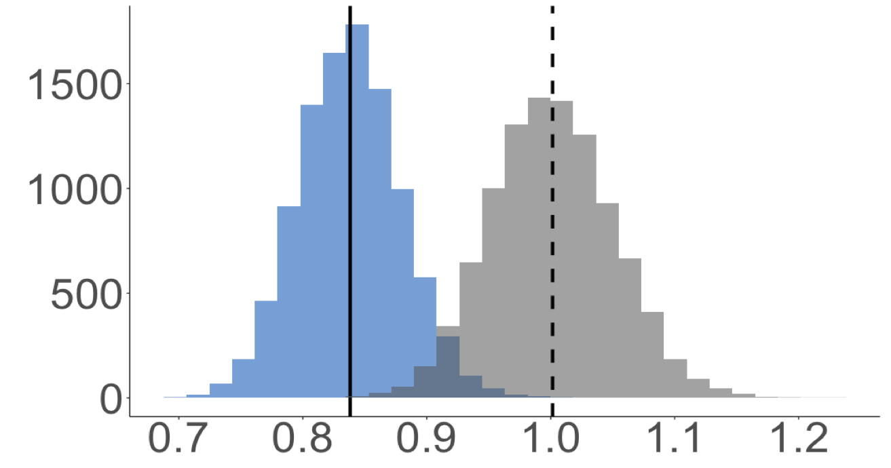
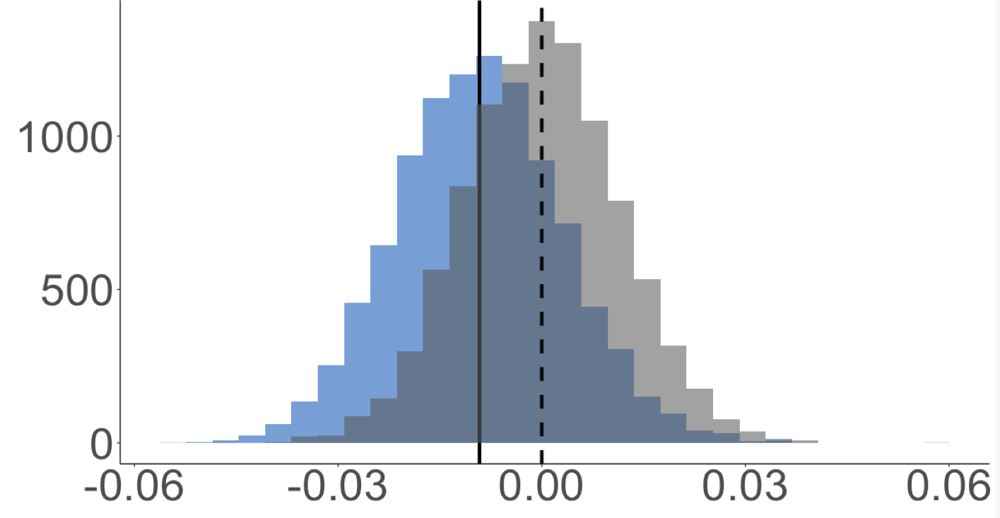
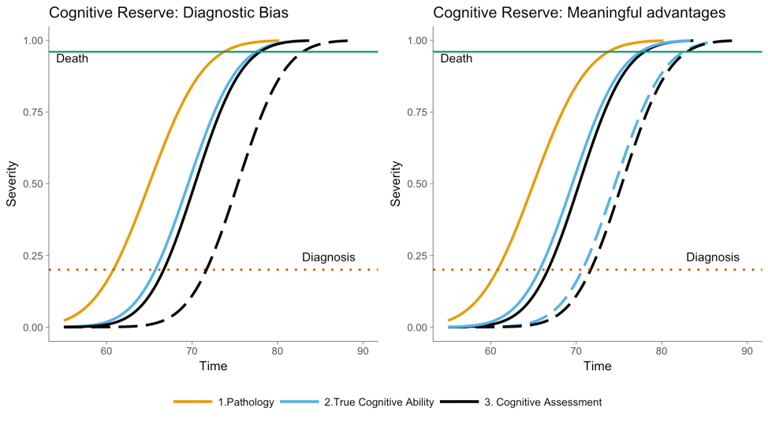
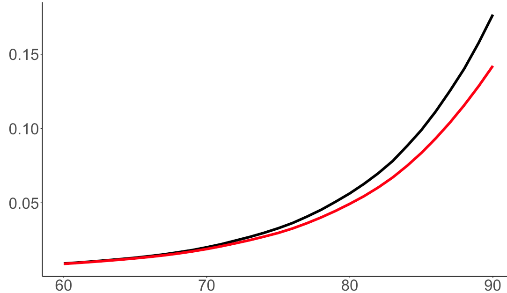

## Quick Intro Slide - <font size = 7 color="#d55e00">AboutMe</font>  

<br>
<div class = 'fragment'>
&#8210;Phd in Biostatistics from UC Davis, 2017  
</div>
<br>
<div class = 'fragment'>
&#8210;Post-doc at UCSF, Epidemiology and Biostatistics group  
</div>
<br>
<div class = 'fragment'>
&#8210;Most of my work is under the broad umbrella of Alzheimer's disease (AD), dementia and cognitive aging. 
</div>

---  

<font size = 7 color ="#d55e00" >Focus Areas:</font> 

<font size = 6>

<div class = 'fragment'>
**Simulation approaches to guide in understanding complex relationships** &#8210; surival bias, diagnostic bias, causal relationships, gap between RCT and observational studies
</div>

<div class = 'fragment'>
**Cognitive Reserve and evaluating phenotypes of those at highest genetic risk for AD**  
</div>

<div class = 'fragment'>  
**Understanding differences in AD phenotypes across ethnoracial backgrounds** &#8210;pathologic, clinical, healthcare setting
</div>


<div class = 'fragment'> 
**Heterogeneous treatment effects (causal forests)**, **longitudinal modeling**, **(un)supervised learning**, **Mendelian Randomization**
</div>

<div class = 'fragment'>
**Data sets:** UK Biobank, ADNI, NACC, Health and Retirment Study (HRS)
</div>  
</font>


## Today  

<div class="fragment">
Combine a little bit from two of these areas: 
</div>

<div class="fragment">
1. Simulation approach towards understanding cognitive reserve
</div>

<br>

<div class="fragment">  

2. Discuss recent paper on cognitive reserve, genetic risk and AD phenotypes with an application in the **UK Biobank**. 

</div>  


## Cognitive Reserve: what it is and what it isn't 

<br>

<div class="fragment">  

- **Cognitive reserve (CR):** the capacity to maintain high cognitive functioning in the face of substantial neuropathology.

</div>

<br>

<div class="fragment">  

 - CR is <font color="#DC3220">**not**</font> related to differences in brain structure that could account for differences in function.  

</div>

<br>

<div class="fragment">  

- Education is commonly used as proxy for Cognitive Reserve (other proxys: occupation, childhood IQ)

</div>


## Why is it important?  

<div class = "fragment">    
<font size = "7" color="#009e73">**Phenotypes**</font> <font size = "6"> It can guide in understanding **what** to look for, **who** to look for, **where** to look, and **when** to look </font>
</div>

<div class="fragment">  

<font size = "7" color="#009e73">**Treatment**</font> <font size = "6"> In order to treat, we need to get to people early on in the disease process; are we missing people?</font>

</div>

<div class="fragment">  

<font size = "7" color="#009e73">**Prevention**</font> <font size = "6">  Cognitive reserve is a potentially modifiable risk factor; early life interventions</font>

</div>

<div class="fragment">  

<font size = "7" color="#009e73">**Clinical trials**</font> <font size = "6"> Inform participation criteria and evaluation of cognitive change amoung trial participants.</font>

</div>

<div class="fragment">  

<font size = "7" color="#d55e00">**Overall**</font> <font size = "6">  Understanding CR could potentially shed light on the course of AD pathology. </font>

</div>


## Motivation for this work 

<div class="fragment">  

### Two conflicting observations with two conflicting hypotheses

<div class="fragment">  

<font size = "8" color="#d55e00">Observations</font>

</div>  

<div class="fragment">  

1. People with high cognitive reserve, e.g., more education, have lower rates of dementia 
</div>
<br>

<div class="fragment">  

2. Among people already diagnosed with dementia, people with high cognitive reserve have faster rates of cognitive decline

</div>


<div class="fragment">
Why are we seeing these conflicting observations?
</div>

---  

<div>
<font size = 8 color = '#d55e00'>CR Hypothesis 1: Diagnostic Bias</font>
</div>

<div class = 'fragment'> 

Cognitive reserve delays diagnosis because it reduces the sensitivity of clinical diagnoses to underlying disease, it **does not** convey meaningful functional advantages to individuals 

</div>  

<div>
<font size = 8 color = '#d55e00'>CR Hypothesis 2: Meaningful advantages</font>
</div>   

<div class = 'fragment'> 

Cognitive reserve delays diagnosis because it provides delays in disease progression (or compression of morbidity), it **does** provides meaningful functional advantages to individuals

</div> 

---  

<font size = 8 color = '#d55e00'>CR Hypothesis 1: Diagnostic Bias</font> 

<div class = 'fragment'>

<font size = "8" color="#009e73">**Goal**</font>
</div>

<div class = 'fragment'>
To understand if CR conceptualized as diagnostic bias could explain the two patterns observed. 
</div>

<br>

<div class = 'fragment'>
<font size = "8" color="#009e73">**Obstacle**</font> 
</div>

<div class = 'fragment'>
Assessing the effects of diagnostic bias in real datasets is challenging
</div> 

<div class="fragment">  

We took a simulation approach

</div>

---  

### *A simulation approach to understanding cognitive reserve*

<p>2018 Advanced Psychometrics Methods in Cognitive Aging Research Workshop</p>

<p>Psychometric and statistical methods for cognitive aging science</p>

<p><font size = '5'>Teresa Filshtein, Maria Glymour, Jennifer Weuve, Adam Staffaroni, Seo-Eun Choi</font></p>


## Simulation: 5 step approach  

<font size = "6">

<div class = "fragment">
<font size = "7" color="#DC3220">Step 1:</font> Develop causal diagram; build code adaptable to test theories
</div> 

<div class = "fragment">
<font size = "7" color="#DC3220">Step 2:</font> Generate data as encoded by the causal diagram (assumptions, statistical associations, distributions)
</div>

<div class = "fragment">
<font size = "7" color="#DC3220">Step 3:</font> Estimate the effect of cognitive reserve on: dementia risk, cognitive decline post diagnosis.
</div>

<div class = "fragment">
<font size = "7" color="#DC3220">Step 4:</font> Repeat steps 2,3 many (10,000) times. 
</div>

<div class = "fragment">
<font size = "7" color="#DC3220">Step 5:</font>
Evaluate the contrast of the observed effect with the underlying true effect. This represents the bias caused by delays in diagnosis.

</div>

</font>

--- 


```{r, out.width = "100%", fig.cap = " ", echo = FALSE}
knitr::include_graphics("p1.pdf")

```

---  

```{r, out.width = "100%", fig.cap = " ", echo = FALSE}
knitr::include_graphics("p2.pdf")

```

---    

```{r, out.width = "100%", fig.cap = " ", echo = FALSE}
knitr::include_graphics("p3.pdf")

```

---    

```{r, out.width = "100%", fig.cap = " ", echo = FALSE}
knitr::include_graphics("p4.pdf")

```

---    

```{r, out.width = "100%", fig.cap = " ", echo = FALSE}
knitr::include_graphics("p5.pdf")

```

---    

```{r, out.width = "100%", fig.cap = " ", echo = FALSE}
knitr::include_graphics("p6.pdf")

```

---    

```{r, out.width = "100%", fig.cap = " ", echo = FALSE}
knitr::include_graphics("p7.pdf")

```

---    

```{r, out.width = "100%", fig.cap = " ", echo = FALSE}
knitr::include_graphics("p8.pdf")

```

---    

```{r, out.width = "100%", fig.cap = " ", echo = FALSE}
knitr::include_graphics("p9.pdf")

```

---    

```{r, out.width = "100%", fig.cap = " ", echo = FALSE}
knitr::include_graphics("p10.pdf")

```

---    

```{r, out.width = "100%", fig.cap = " ", echo = FALSE}
knitr::include_graphics("p11.pdf")

```

---    

```{r, out.width = "100%", fig.cap = " ", echo = FALSE}
knitr::include_graphics("p12.pdf")

```

---    

```{r, out.width = "100%", fig.cap = " ", echo = FALSE}
knitr::include_graphics("p13.pdf")

```

---    

```{r, out.width = "100%", fig.cap = " ", echo = FALSE}
knitr::include_graphics("p14.pdf")

```

---    

```{r, out.width = "100%", fig.cap = " ", echo = FALSE}
knitr::include_graphics("p15.pdf")

```

---    

```{r, out.width = "100%", fig.cap = " ", echo = FALSE}
knitr::include_graphics("p16.pdf")

```

---    

```{r, out.width = "100%", fig.cap = " ", echo = FALSE}
knitr::include_graphics("p17.pdf")

```

---    
  

```{r, out.width = "100%", fig.cap = " ", echo = FALSE}
knitr::include_graphics("p18.pdf")

```

---    

```{r, out.width = "100%", fig.cap = " ", echo = FALSE}
knitr::include_graphics("p19.pdf")

```

---    

```{r, out.width = "100%", fig.cap = " ", echo = FALSE}
knitr::include_graphics("p20.pdf")

```

---    

```{r, out.width = "100%", fig.cap = " ", echo = FALSE}
knitr::include_graphics("p21.pdf")

```

---    

```{r, out.width = "100%", fig.cap = " ", echo = FALSE}
knitr::include_graphics("p22.pdf")

```

---    

```{r, out.width = "100%", fig.cap = " ", echo = FALSE}
knitr::include_graphics("p23.pdf")

```

---    

```{r, out.width = "100%", fig.cap = " ", echo = FALSE}
knitr::include_graphics("p24.pdf")

```

---    

```{r, out.width = "100%", fig.cap = " ", echo = FALSE}
knitr::include_graphics("p25.pdf")

```

---    

```{r, out.width = "100%", fig.cap = " ", echo = FALSE}
knitr::include_graphics("p26.pdf")

```

---    

```{r, out.width = "100%", fig.cap = " ", echo = FALSE}
knitr::include_graphics("p27.pdf")

```

---    

```{r, out.width = "100%", fig.cap = " ", echo = FALSE}
knitr::include_graphics("p28.pdf")

```

---    

```{r, out.width = "100%", fig.cap = " ", echo = FALSE}
knitr::include_graphics("p29.pdf")

```

---    

```{r, out.width = "100%", fig.cap = " ", echo = FALSE}
knitr::include_graphics("p30.pdf")

```

---    

```{r, out.width = "100%", fig.cap = " ", echo = FALSE}
knitr::include_graphics("p31.pdf")

```

## Cognitive Reserve as Diagnostic Bias

```{r, out.width = "100%", fig.cap = " ",echo = FALSE}
knitr::include_graphics("p31.pdf")

```  

--- 

### Exogenous variables

<div class="column-right">
```{r, out.width = "100%", fig.cap = " ",echo = FALSE}
knitr::include_graphics("p32.pdf")

```  
</div>

<font size = "5">

<div class="column-left">

<font size = "5" color="#DC3220">**Brain Pathology:**</font>  
<p>Distribution: Ordinal(0,1,2) </p>

<font size = "5" color="#DC3220">**Baseline Cognitive Level**</font> 
<p>Distribution: $N(\mu_1, \sigma_1)$</p>  

<font size = "5" color="#DC3220">**Cognitive Reserve**</font>
<p>Distribution: $N(\mu_2, \sigma_2)$</p>  

<font size = "5" color="#DC3220">**Test Error**</font> 
<p>Distribution: $N(\mu_3, \sigma_3)$</p>

</div>

</font>

---  


### Endogenous variables

<div class="column-right">
```{r, out.width = "100%", fig.cap = " ",echo = FALSE}
knitr::include_graphics("p33.pdf")

``` 

</div>

<font size = "4">

<div class="column-left">

<font size = "5" color="#DC3220">**Rate of Cognitive Decline**</font>
<p>$f(\text{Brain Path})$</p>

<font size = "5" color="#DC3220">**True Cognitive Level**</font>  
<p>$f(\text{Rate of Cog.Decline}, \text{TrueCog}_{t-1})$</p>

<font size = "5" color="#DC3220">**Survival**</font>  
<p>$f(\text{Brain Path,}\text{TrueCog}_{t-1})$</p>

<font size = "5" color="#DC3220">**Observed Cognitive Level**</font>  
<p>$f(\text{TrueCog,CR})$</p>

<font size = "5" color="#DC3220">
**ADL**
</font>  
<p>$f(\text{TrueCog})$</p>

<font size = "5" color="#DC3220">**Diagnosis**</font>  
<p>$f(\text{Obs.Cog,ADL})$</p>

</div>

</font>

---    

<font size = "6">
<font size = "7" color="#d55e00">**Assessment of CR as diagnostic bias:**</font>

<div class = fragment>
 1. Risk of dementia: Cox model, estimate the effect of CR on dementia risk
  
  $$h(t) = h_0(t)e^{(\beta_1CR)}$$
</div>        
  <br>
  
<div class = fragment>    
  2. Cognitive Decline post dementia diagnosis; linear mixed effect model; interaction between CR and slope.
  
  $$\text{Cognition}_{ij} = \beta_0 +b_{0i}+ (\beta_1 + b_{1i})Age_{ij} + \beta_2 CR_i +$$ 
  $$\beta_3 Age_{ij}*CR_i + \epsilon_{ij}$$
  
</div>
</font>

--- 

### Simulating the Data: <font size = "8" color="#d55e00">psuedo algorithm</font>  
<font size = "5">

<div class = 'fragment'> 
Sample: 
<p> N = 1000 </p>
<p> Observed over 30 years (ages 60-90) </p>
</div>

<div class = 'fragment'> 

<font size = "6" color="#009e73">1. Initialize: </font>   

For each individual, generate: 
<p>&#8210; Cognitive Reserve for each individual $N(0,1)$  </p>
<p>&#8210; Baseline cognitive level $N(0,1)$  </p>
<p>&#8210; Baseline pathology for each individual (0,1,2)   </p>
<p>&#8210; Individual rate of cognitive decline $\beta(a,b)$ </p>

</div>     
</font>

---  

<font size = "5">
<font size = "6" color="#009e73">2. At each time interval (one year)</font>  
An individual:   

<div class = "fragment">
&#8210;Can become disabled ($p_{dis}$)  
</div>  

<div class = "fragment">
&#8210;Can die ($p_{death}$)  
</div>  

<div class = "fragment">

&#8210;May experience an increase in pathology (max path = 2)  
</div>  

<div class = "fragment">

&#8210;Experiences one year of true cognitive decline  
</div>  

<div class = "fragment">
&#8210;Takes a cognitive test:  
</div>


<div class = "fragment">
&#8210;<font color="#DC3220">Score.observed</font> = true cog. + CR + error 
</div>

<div class = "fragment">
&#8210;<font color="#009e73">Score.truth</font> = true cog. + error
</div>  

<div class = "fragment">
Is diagnosed if: 
</div>

<div class = "fragment">
&#8210;<font color="#DC3220">Dx.observed</font> = I(Score.observed<Threshold) & Disabled
</div>

<div class = "fragment">
&#8210;<font color="#009e73">Dx.truth</font> = I(Score.truth<Threshold) & Disabled
</div>

</font>    
  
---  

<br>  

After 30 years, we retrospectively estimate: 
<div class = 'fragment'>

<br>

- Hazard ratio for CR for incident dementia  
</div>

<br>

<div class = 'fragment'>
 - Effect of CR on rate of post-diagnosis cognitive decline
</div>


---  

<font size = "6">

<font size = "8" color="#d55e00">Key Results</font>  

<div class = 'fragment'>
<font size = "6"> **On average, diagnosis was delayed:** </font>
</div>

<div class = 'fragment'>
  &#8210; 1.5 years for those with positive CR  
  
  &#8210; up to 4.5 years for those at higher levels of CR (> 1 SD above normal)
</div>

<div class = 'fragment'>

<font size = "6">**On average, this accounted for:**</font>
</div>

<div class = 'fragment'>
 &#8210;4% of people with higher CR, that would have been diagnosed, but died before they could be  
 
 &#8210;30% of high CR indivduals were diagnosed late
 
</div>

<div class = fragment>
<font size = "7">Could this explain the patterns we are seeing in observational data?</font>
</div>

</font>

---  

<font size = "8" color="#d55e00">Results</font>  

Average HR for 1 SD in CR increase = 0.83

<div>
```{r, out.width = "100%", fig.cap = " ",echo = FALSE}


```  
</div>

--- 

<font size = "8" color="#d55e00">Results</font>  

Average accelerated decline for 1 SD inc CR  = -0.1 SD

<div >
```{r, out.width = "100%", fig.cap = " ",echo = FALSE}


```  
</div>

--- 

<font size = "6">
<font size = "8" color="#d55e00">Take Aways</font> 

<br>

<div class = 'fragment'>
&#8210; We used a simulation approach evaluate the impact of diagnostic bias on two key outcomes
<div>

<br>

<div class = 'fragment'>
&#8210; When CR was purely diagnostic bias, we were able to see two key patterns observed in observational studies
<div>

<br>

<div class = 'fragment'>
&#8210; Researchers, clinicians, individuals should factor proxy measures of congitive reserve into their diagnoses and evaluations. 
<div>

</font>

--- 

### *Reserve and Alzheimer’s disease genetic risk: effects on hospitalization and mortality*

<p><font size = '5'>Authors: Teresa Jenica Filshtein, PhD; Willa D. Brenowitz, PhD, MPH; Elizabeth Rose Mayeda, PhD, MPH; Timothy J. Hohman, PhD; Stefan Walter, PhD; Rich N. Jones, PhD; Fanny M. Elahi, MD PhD, M. Maria Glymour, ScD</font><p>

---  

<font size = "8" color="#d55e00">Highlights</font>

<div class = "fragment">

<font size = "6" color="#009e73">Goal:</font> <font size = "6"> Evaluate the net impact of cognitive reserve (CR) on adverse outcomes associated with dementia</font>

</div>

<div class = "fragment">

<font size = "6" color="#009e73">Trick:</font> <font size = "6"> Outcomes must not be contingent on an individual having been diagnosed with dementia, or outcomes subject to bias (e.g., time-to-death post diagnosis, etc.);  potential for missed diagnoses of high CR people.</font>   
</div>

<div class = "fragment">

<font size = "6" color="#009e73">Idea:</font> <font size = "6">  Use AD genetic risk scores to identify those at greatest risk for cognitive decline; identify outcomes related to dementia in a way that is not influenced by timing of diagnosis  </font>
</div>

<div class = "fragment">
<font size = "6" color="#009e73">Outcomes:</font> <font size = "6">  Phenotypes indicative of cognitive decline; clear and undisputed (very little potential for misdiagnosis)</font>

</div>

---  

<font size = "8" color="#d55e00">Study</font>  

<div class = "fragment">

<font size = "6" color="#DC3220">Population:</font> <font size = "5"> UK Biobank participants age 56+, excluded those with missing/poor genetic information, restricted to genetic ethnicity "Caucasian", (N ~ 250K) </font>  
</div>

<div class = "fragment">

<font size = "6" color="#DC3220">Measures:</font><font size = "5"> 
<p>&#8210; **2 AD Genetic Risk Scores**; 26 SNPs previously associated with AD from independent GWAS, removed the 2 SNPs along chromosome 19 that are used to characterize APOE status </p>
<p>&#8210; **Mortality:** all cause, dementia-related (ICD 10 codes)</p>
<p>&#8210; **Hospitalization:** overall count, falls, UTIs (ICD 10 codes)</p>
<p>&#8210; **Cognitive Reserve:** High/Low based on education/professional qualifications</p>
</font>  
</div>   

<div class = "fragment">
<font size = "6" color="#DC3220">Model:</font><font size = "5"> 
<p>&#8210; **Mortality:** Cox proportional hazard models, competing risks (dementia/non-dementia)</p>
<p>&#8210; **Hospitalization:** overall count (poisson regression, offset for observed years), falls/UTIs (logistic regression)</p>
</font>  
</div>  

---  

```{r, out.width = "90%", fig.cap = " ", echo = FALSE}
knitr::include_graphics("CRGRS.pdf")

```  

---  

<font size = "8" color="#d55e00">Analytic Approach</font>   

<font size = 6>

<div class = fragment>
<font color = 'darkblue'>**Step 0:**</font> Confirm that the AD GRS is associated with cognitive decline. 
</div>

<div class = fragment>
<font color = 'darkblue'>**Step 1:**</font> Test if the AD GRS is associated with each outcome  

<p><font size = 5> &#8211; controlled for genetic sex, genetic ancestry (through principal components)</font></p>
</div>

<div class = fragment>
<font color = 'darkblue'>**Step 2:**</font> Compare estimated effect of AD-GRS on each outcome with and without CR  

<p><font size = 5> &#8211; confirm CR was not mediating AD-GRS effects</font> </p>
</div>

<div class = fragment>
<font color = 'darkblue'>**Step 3:**</font> Compared the estimated effect of the AD-GRS measure on each outcome among individuals with higher CR versus individuals with lower CR  

<p><font size = 5> &#8211; included an interaction term to test whether effects were significantly different between high and low CR individuals</font> </p>
</div>

</font>

---  

<font size = "8" color="#d55e00">Results - Mortality </font><font size = "6" >All-cause, Dementia, and non-Dementia </font>  

```{r results='hide', tidy=F, echo=FALSE}
library(ggplot2)
library(gridExtra)
library(RColorBrewer)
cbbPalette <- c("#000000", "#E69F00", "#56B4E9", "#009E73", "#F0E442", "#0072B2", "#D55E00", "#CC79A7")
datmortE4 <- data.frame(group = factor(c("A","B","C","D","E","F","G","H","I")),
                  colorline = factor(c(
                    rep("Non-Dementia",3),
                    rep("Dementia",3),
                    rep("All-cause",3)
                    ),
                    levels = c("Non-Dementia", 
                               "Dementia",
                               "All-cause"
                               )),
                  linetype1 = factor(rep(c("Low CR","High CR","Total"),3),
                                     levels = c("Low CR","High CR", "Total")),
                  cen = c(1.01,1.07,1.03,
                          1.98,2.02,1.99,
                          1.05,1.12,1.07),
                  low = c(0.94,0.98,0.97,
                          1.56,1.50,1.66,
                         0.99, 1.03,1.02),
                  high = c(1.07,1.17,1.08,
                          2.51,2.71, 2.40,
                           1.11,1.22,1.13))

datmortnoE4 <- data.frame(group = factor(c("A","B","C","D","E","F","G","H","I")),
                  colorline = factor(c(
                    rep("Non-Dementia",3),
                    rep("Dementia",3),
                    rep("All-cause",3)
                    ),
                    levels = c("Non-Dementia", 
                               "Dementia",
                               "All-cause"
                               )),
                  linetype1 = factor(rep(c("Low CR","High CR","Total"),3),
                                     levels = c("Low CR","High CR", "Total")),
                  cen = c(0.98,0.95,0.97,
                          1.74,1.57,1.67,
                          1.02,1.03,1.00),
                  low = c(0.85,0.78,0.87,
                          0.94,0.73,1.03,
                         0.88, 0.81,0.90),
                  high = c(1.14,1.16,1.10,
                          3.22,3.40, 2.70,
                           1.17,1.31,1.13))

datUTIFALLnoE4 <- data.frame(group = factor(c("A","B","C","D","E","F","G","H","I","J","K","L")),
                  colorline = factor(c(
                    rep("UTIs & Falls",3),
                    rep("UTIs",3),
                    rep("Falls",3),
                    rep("Total",3)
                    ),
                    levels = c("UTIs & Falls", 
                               "UTIs",
                               "Falls",
                               "Total"
                               )),
                  linetype1 = factor(rep(c("Low CR","High CR","Total"),4),
                                     levels = c("Low CR","High CR", "Total")),
                  cen = c(1.15,0.95,1.07,
                          1.17,0.99,1.10,
                          1.12,0.97,1.06,
                          1.05,.997,1.03),
                  low = c(1.04,0.83,0.99,
                          1.00,0.82,0.98,
                         0.97, 0.81,0.95,
                         1.03,0.97,1.01),
                  high = c(1.28,1.09,1.16,
                          1.36,1.21,1.24,
                           1.28,1.14,1.17,
                          1.07,1.02,1.05))


theme_set(theme_bw())
theme_update(
    axis.line = element_line(colour = "black"),
    panel.grid.major = element_blank(),
    panel.grid.minor = element_blank(),
    panel.border = element_blank(),
    panel.background = element_blank(),
    axis.text.y = element_blank(),
    axis.ticks.y = element_blank(),
    plot.margin = unit(c(0,0,0,0), "lines")
)
pfunc = function(df){
  ggplot(df,aes(cen,group,color = colorline)) + 
    geom_point(aes(shape = linetype1), size=7) +
    geom_errorbarh(aes(xmax = high, xmin = low), height = 0.15, size=1.5) +
    geom_vline(xintercept = 1, linetype = "longdash",size = 1) +
    scale_x_continuous(breaks = seq(0,4,.5), labels = seq(0,4,.5)) +
    labs(x="", y="")  + 
  theme(axis.text.x = element_text(size = 20), 
        legend.key.size = unit(3,'line'), 
        legend.title = element_blank(),
        legend.text = element_text(size = 20)) 
}

```

```{r,echo = FALSE}

pfunc(datmortE4)+ scale_color_manual(values=cbbPalette[2:4])

```

---  

<font size = "8" color="#d55e00">Results-Hospitalization:</font><font size = "6" > Count, Falls, UTIs, Falls/UTIs</font>  

```{r,echo = FALSE}
pfunc(datUTIFALLnoE4)+ scale_color_manual(values=cbbPalette[5:8])

```

---  

<font size= 6>
<font size = "8" color="#d55e00">Take Aways</font>  

<div class = 'fragment'>
AD genetic risk is used to evaluate impacts of cognitive reserve (CR) on adverse outcomes  
</div>

<div class = 'fragment'>
We considered outcomes: premature mortality and three hospitalization outcomes
</div>


<div class = 'fragment'>
CR, conceptualized as education, did not convey differential mortality advantages.
</div>

<div class = 'fragment'>
There was suggestive evidence that CR reduces hospitalizations due to dementia
</div>

<div class = 'fragment'>
Results call into question the net benefit of education for clinical AD burden
</div>

</font>

---

<font size ="10">
<font color="#DC3220">T</font><font color="#d55e00">H</font><font color="#009e73">A</font><font color = 'darkblue'>N</font><font color = 'yellow'>K</font> YOU! 

### &#9792; Happy Women's Day! &#9792;
</font>

# Appendix 1

--- 


```{r, out.width = "90%", fig.cap = " ", echo = FALSE}


```  

---  

```{r, out.width = "90%", fig.cap = 'Simulated (black) vs Census (red) Mortality Rate', echo = FALSE}


```  


# Appendix 2

--- 

```{r, out.width = "100%", fig.cap = " ", echo = FALSE}
knitr::include_graphics("p35.pdf")

```

---    

```{r, out.width = "100%", fig.cap = " ", echo = FALSE}
knitr::include_graphics("p36.pdf")

```

---   

```{r, out.width = "100%", fig.cap = " ", echo = FALSE}
knitr::include_graphics("p37.pdf")

```

---    

```{r, out.width = "100%", fig.cap = " ", echo = FALSE}
knitr::include_graphics("p38.pdf")

```

--- 

```{r, out.width = "100%", fig.cap = " ", echo = FALSE}
knitr::include_graphics("p39.pdf")

```

---    

```{r, out.width = "100%", fig.cap = " ", echo = FALSE}
knitr::include_graphics("p40.pdf")

```


